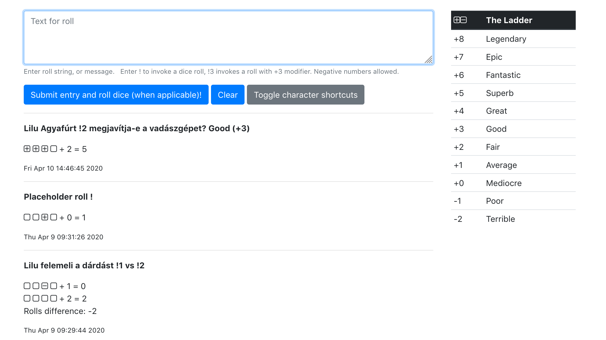

# Pyfate

Python based web application for Fate Pen & Paper RPG event logging and dice rolling.  
Written during the COVID-19 crysis of 2020 to help facilitating Pen and Paper RPGs over Zoom.

## Screenshot

## Technologies used

- [Python3](https://www.python.org/downloads/)
- [Bottle](https://bottlepy.org/) web application framework
- [Bootstrap](https://getbootstrap.com/) responsible website framework
- [JQuery](https://jquery.com/) JavaScript framework
- [JSON](https://www.json.org/) storage
- Hosted on [pythonanywhere.com](https://pythonanywhere.com)

## Deploying on pythonanywhere.com

1. Register at [pythonanywhere.com](https://pythonanywhere.com) _(if you don't have an account yet)_
2. Create a new web application

   Python 3.8  
   Bottle web application
3. Start a bash console
4. git clone this repository
5. rename repository to myfiles

## TODO, future plans

- Primitive Character sheets integration (already done statically)

